Noodle unfinished 2D/3D framework 
=================================

This repository contains an abandoned 2d/3d programming framework
where i was experimenting algorithmic and exploring computer theory.

Exemples samples you can find:

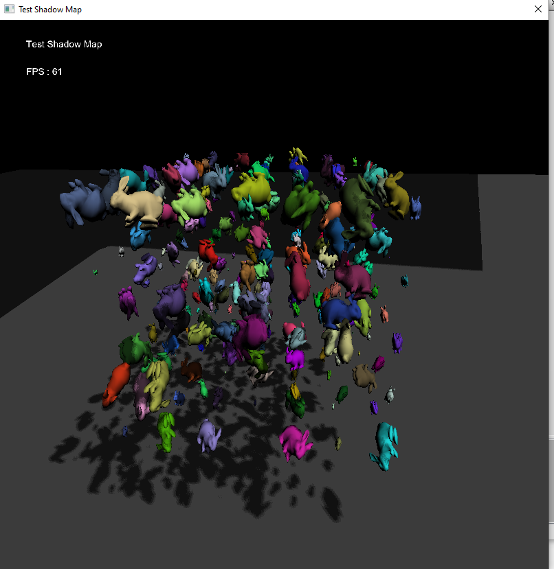
https://github.com/benmalartre/Noodle/blob/master/src/test/TestShadow.pbi

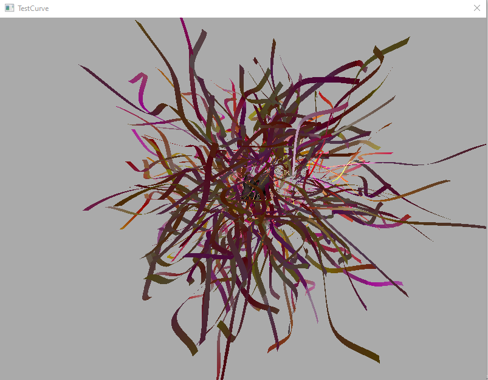
https://github.com/benmalartre/Noodle/blob/master/src/test/TestCurve.pbi

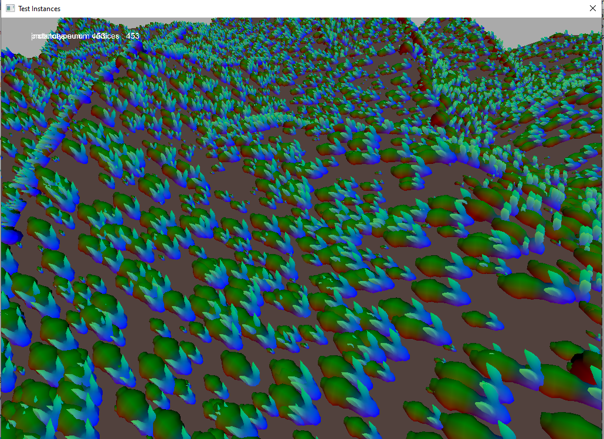
https://github.com/benmalartre/Noodle/blob/master/src/test/TestInstances.pbi

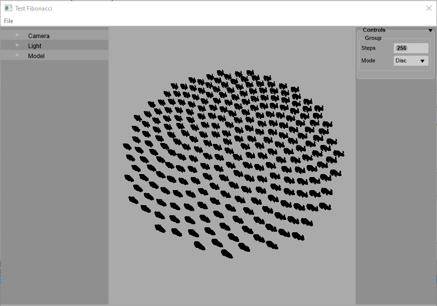
https://github.com/benmalartre/Noodle/blob/master/src/test/TestFibonacci.pbi

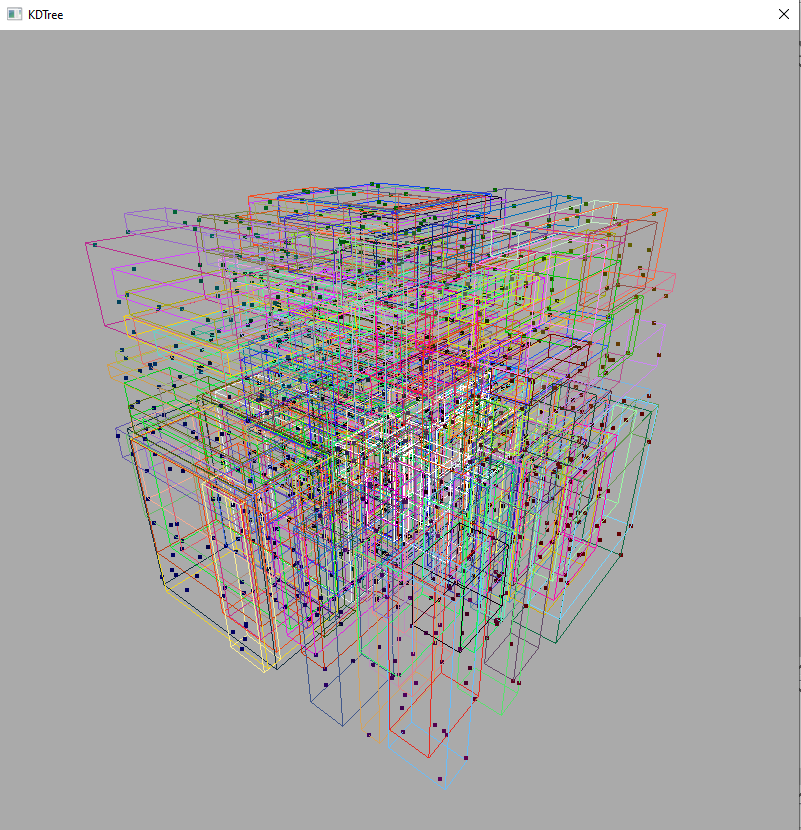
https://github.com/benmalartre/Noodle/blob/master/src/test/TestKDTree.pbi

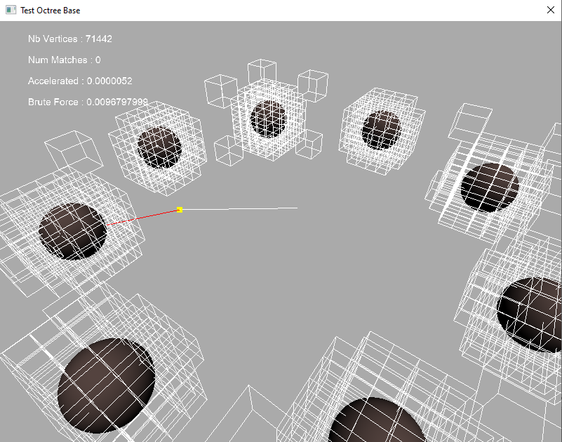
https://github.com/benmalartre/Noodle/blob/master/src/test/TestOctree.pbi

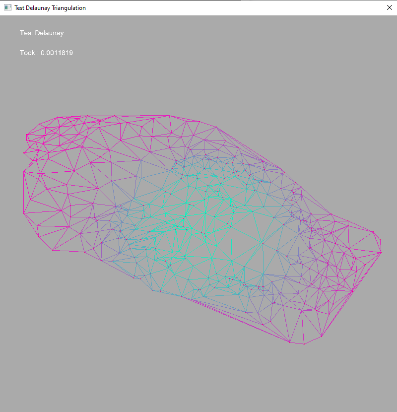
https://github.com/benmalartre/Noodle/blob/master/src/test/TestDelaunay.pbi

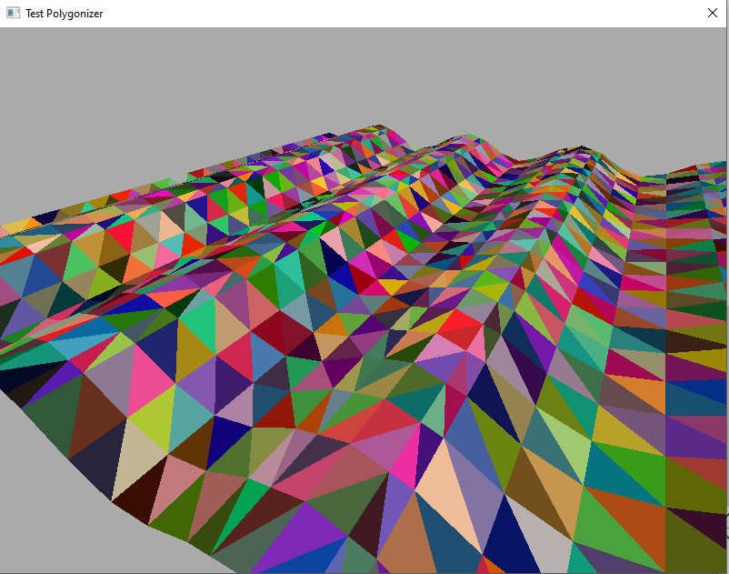
https://github.com/benmalartre/Noodle/blob/master/src/test/TestPolygonizer.pbi

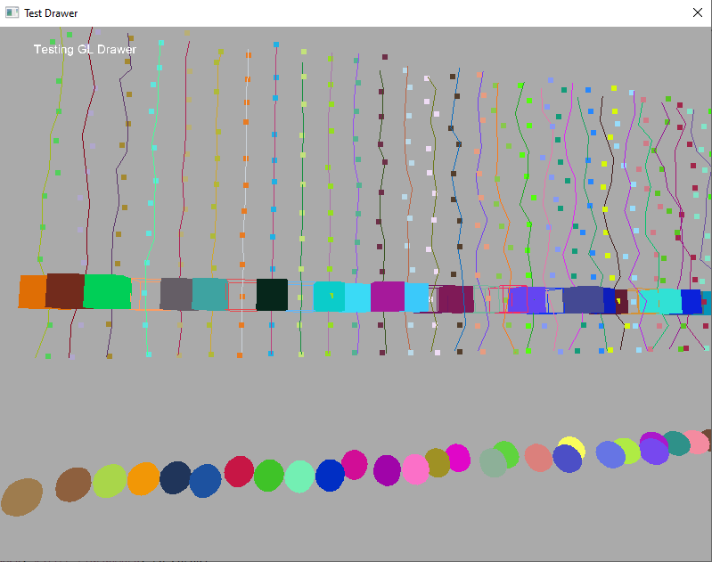
https://github.com/benmalartre/Noodle/blob/master/src/test/TestDrawer.pbi

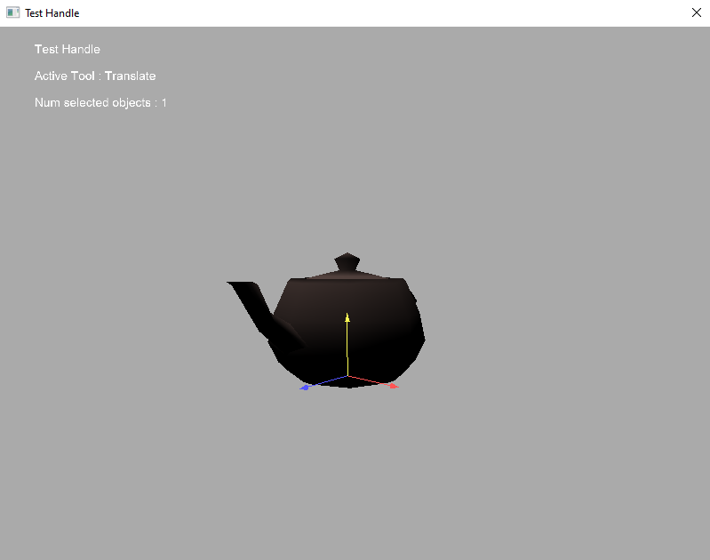
https://github.com/benmalartre/Noodle/blob/master/src/test/TestHandle.pbi

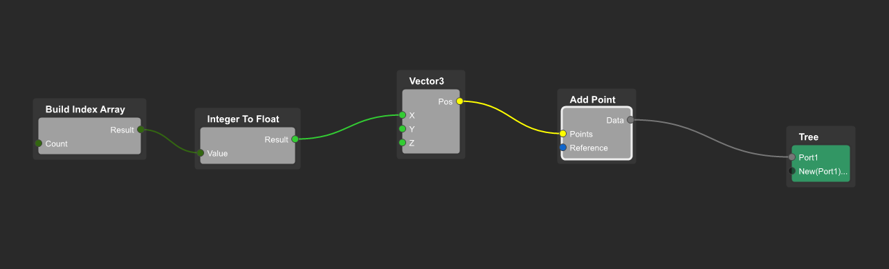

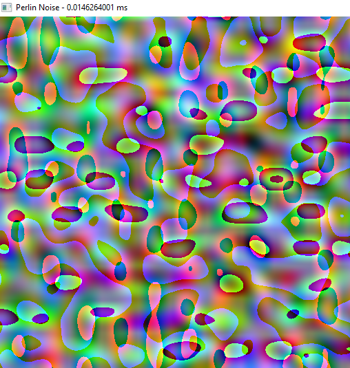
https://github.com/benmalartre/Noodle/blob/master/src/test/TestPerlin.pbi

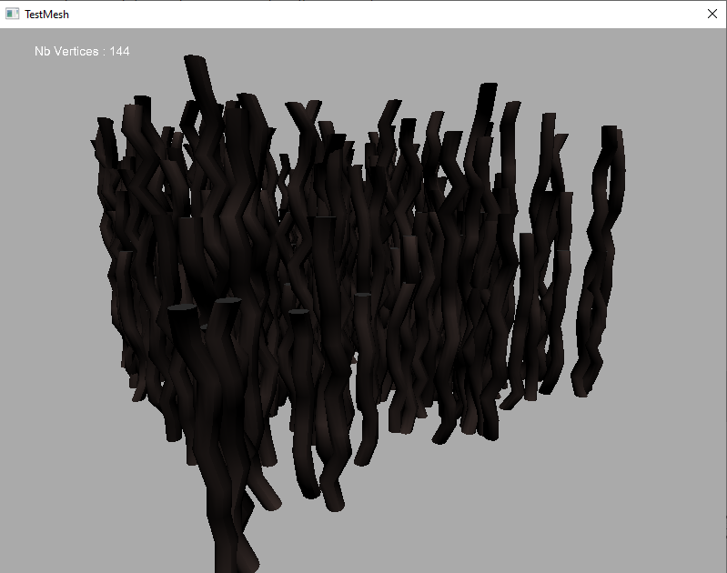
https://github.com/benmalartre/Noodle/blob/master/src/test/TestExtrusion.pbi

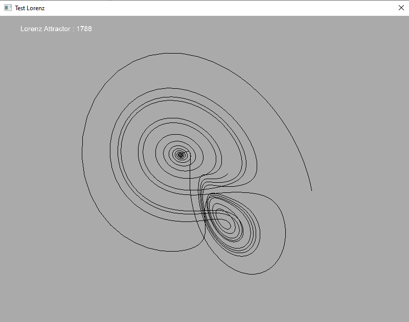
https://github.com/benmalartre/Noodle/blob/master/src/test/TestLorenz.pbi

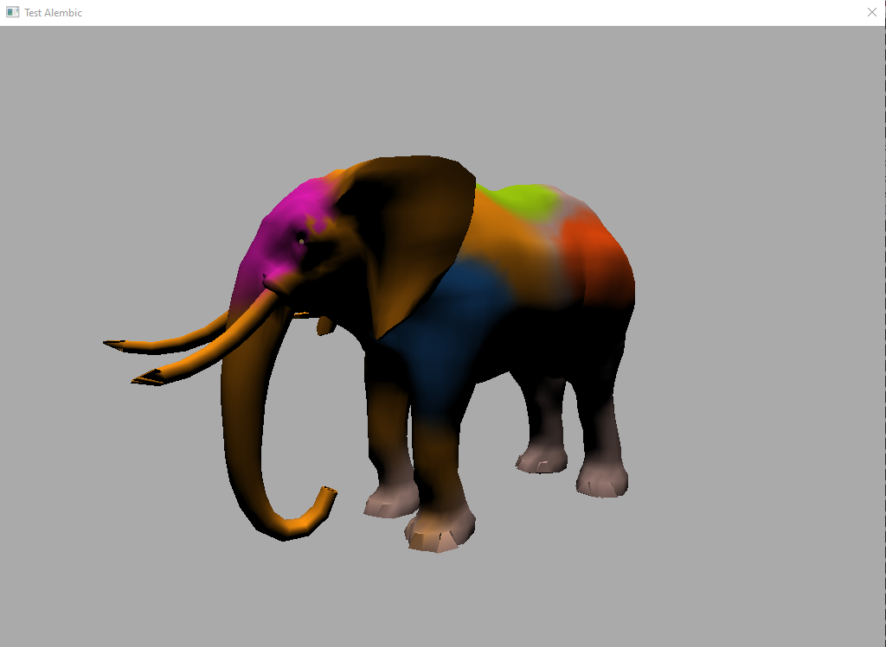
https://github.com/benmalartre/Noodle/blob/master/src/test/TestAlembic.pbi

Build Status
------------
To build this project yourself you must have a PureBasic license as the code base exceed the maximum lines (800) allowed by the free demo version.
Some demos will build some others will not.
I know it's a mess and there are lots of mistake, that's how we learn!

Supported Platforms
-------------------

Windows, Linux and Macos

Dependencies
------------

Required:
 - [PureBasic](https://www.purebasic.com/)

Optional:
 - C/C++ compiler
 - [CMake](https://cmake.org/documentation/)
 - [Alembic](https://github.com/alembic/alembic) framework for storing and sharing scene data
 - [Booze](https://github.com/benmalartre/Booze) alembic interface for purebasic
 - [STK](https://github.com/benmalartre/STK) sound synthesis library and interface for purebasic
